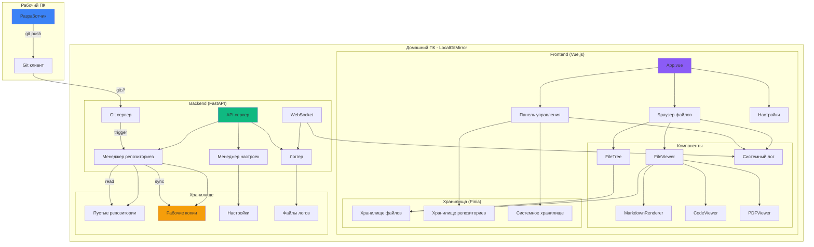
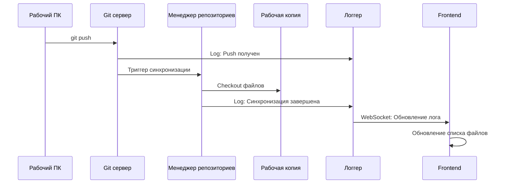
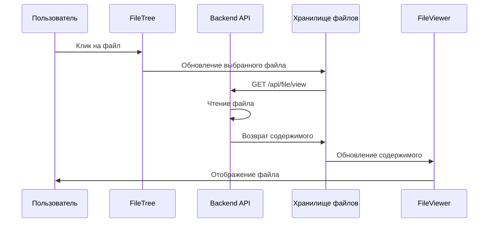
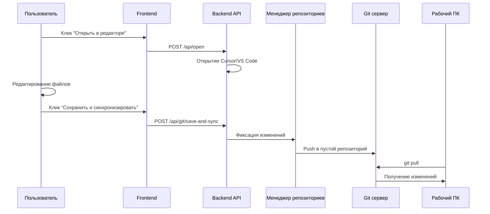
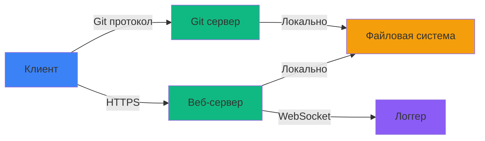

# 🏗️ Архитектура LocalGitMirror v3.2

## Общая схема



## Структура проекта

```
LocalGitMirror/
├── backend/
│   ├── core/
│   │   ├── git_handler.py       # Git сервер
│   │   ├── repo_manager.py      # Управление репозиториями
│   │   ├── git_utils.py         # Git утилиты
│   │   ├── system_monitor.py    # Мониторинг системы
│   │   ├── logger.py            # НОВОЕ: Логирование
│   │   ├── settings_manager.py  # НОВОЕ: Настройки
│   │   └── cache_manager.py     # НОВОЕ: Кэширование
│   │
│   ├── routers/
│   │   ├── api.py               # REST API
│   │   ├── web.py               # Web страницы
│   │   ├── websocket.py         # НОВОЕ: WebSocket
│   │   └── settings.py          # НОВОЕ: API настроек
│   │
│   ├── main.py                  # Точка входа
│   └── requirements.txt
│
├── frontend/                    # НОВОЕ: Vue.js проект
│   ├── src/
│   │   ├── components/
│   │   │   ├── FileTree.vue
│   │   │   ├── FileViewer.vue
│   │   │   ├── MarkdownRenderer.vue
│   │   │   ├── CodeViewer.vue
│   │   │   ├── PDFViewer.vue
│   │   │   ├── Breadcrumbs.vue
│   │   │   ├── Toolbar.vue
│   │   │   ├── SystemLog.vue
│   │   │   ├── StatusBar.vue
│   │   │   ├── WorkflowBanner.vue
│   │   │   ├── ActionButtons.vue
│   │   │   ├── GitTerminal.vue
│   │   │   ├── QuickStats.vue
│   │   │   ├── GitStatus.vue
│   │   │   ├── DiffViewer.vue
│   │   │   ├── CommitHistory.vue
│   │   │   ├── BranchSelector.vue
│   │   │   ├── SearchBar.vue
│   │   │   └── QuickOpen.vue
│   │   │
│   │   ├── views/
│   │   │   ├── Dashboard.vue
│   │   │   ├── FileBrowser.vue
│   │   │   └── Settings.vue
│   │   │
│   │   ├── stores/
│   │   │   ├── files.js
│   │   │   ├── repos.js
│   │   │   └── system.js
│   │   │
│   │   ├── router/
│   │   │   └── index.js
│   │   │
│   │   ├── App.vue
│   │   └── main.js
│   │
│   ├── package.json
│   ├── vite.config.js
│   └── tailwind.config.js
│
├── storage/
│   ├── *.git/                   # Пустые репозитории
│   ├── workspaces/              # Рабочие копии
│   ├── settings.json            # НОВОЕ: Настройки
│   └── logs/                    # НОВОЕ: Логи
│
├── .env
├── TODO.md
├── TASKS_FOR_AGENTS.md
├── SUMMARY.md
└── README.md
```

## Поток данных

### 1. Git Push (Работа → Домой)



### 2. Просмотр файла (Домой)



### 3. Редактирование и синхронизация (Домой → Работа)



## Компонентная архитектура (Vue.js)

### Представление панели управления

```
Dashboard.vue
├── StatusBar.vue
├── WorkflowBanner.vue
├── ActionButtons.vue
│   ├── Button: Открыть Cursor
│   ├── Button: Браузер файлов
│   └── Button: Сохранить и синхронизировать
├── GitTerminal.vue
├── QuickStats.vue
│   ├── Количество файлов
│   ├── Количество изменений
│   └── Последний коммит
└── SystemLog.vue (опционально)
```

### Представление браузера файлов

```
FileBrowser.vue
├── Breadcrumbs.vue
├── Toolbar.vue
│   ├── Button: Открыть в редакторе
│   ├── Button: Обновить
│   ├── Button: Копировать
│   └── Button: Скачать
├── Layout (flex)
│   ├── FileTree.vue (боковая панель)
│   │   ├── Элементы папок
│   │   ├── Элементы файлов
│   │   └── SearchBar.vue
│   └── FileViewer.vue (основной)
│       ├── MarkdownRenderer.vue
│       ├── CodeViewer.vue
│       └── PDFViewer.vue
└── SystemLog.vue (сворачиваемый)
```

### Представление настроек

```
Settings.vue
├── Секция: Общие
│   ├── Репозиторий по умолчанию
│   ├── Папка по умолчанию
│   └── Автосинхронизация
├── Секция: Git
│   ├── Порт Git
│   └── Автозапуск
├── Секция: Редактор
│   ├── Тип редактора
│   └── Пользовательский путь
├── Секция: UI
│   ├── Тема
│   └── Размер шрифта
└── Секция: Ollama
    ├── URL
    └── Модель
```

## Управление состоянием (Pinia)

### Хранилище файлов

```javascript
{
  state: {
    files: [],           // Список всех файлов
    currentFile: null,   // Текущий открытый файл
    currentFolder: '',   // Текущая папка
    fileContent: null,   // Содержимое файла
    loading: false       // Загрузка
  },
  actions: {
    loadFiles(),
    selectFile(),
    loadFileContent(),
    refreshFiles()
  }
}
```

### Хранилище репозиториев

```javascript
{
  state: {
    repos: [],           // Список репозиториев
    currentRepo: 'default',
    branches: [],        // Ветки
    currentBranch: 'main'
  },
  actions: {
    loadRepos(),
    selectRepo(),
    loadBranches(),
    checkoutBranch()
  }
}
```

### Системное хранилище

```javascript
{
  state: {
    gitRunning: false,   // Статус Git сервера
    status: 'idle',      // idle/processing/ready
    logs: [],            // Системные логи
    settings: {}         // Настройки
  },
  actions: {
    startGit(),
    stopGit(),
    loadSettings(),
    saveSettings(),
    connectWebSocket()
  }
}
```

## API endpoints

### Существующие

```
GET  /                          # Панель управления
GET  /files                     # Браузер файлов
GET  /api/status                # Статус системы
GET  /api/files                 # Список файлов
GET  /api/file/view             # Просмотр файла
GET  /api/file/pdf              # Просмотр PDF
GET  /api/repos                 # Список репозиториев
POST /api/repos/select          # Выбор репозитория
POST /api/git/start             # Запуск Git сервера
POST /api/git/stop              # Остановка Git сервера
POST /api/git/save-and-sync     # Сохранение и синхронизация
GET  /api/git/changes           # Список изменений
POST /api/system/open-editor    # Открытие редактора
POST /api/chat                  # AI чат
```

### Новые (планируются)

```
# Настройки
GET  /api/settings              # Получение настроек
POST /api/settings              # Обновление настроек (частичное)
PUT  /api/settings              # Замена всех настроек
GET  /api/settings/defaults     # Значения по умолчанию

# Логи
GET  /api/logs                  # История логов
DELETE /api/logs                # Очистка логов
WS   /ws/logs                   # WebSocket для логов

# Git расширенный
GET  /api/git/status            # Статус всех файлов
GET  /api/git/diff              # Diff файла
GET  /api/git/history           # История коммитов
GET  /api/git/blame             # Blame файла
GET  /api/git/branches          # Список веток
POST /api/git/checkout          # Переключение ветки

# Поиск
GET  /api/search/files          # Поиск файлов
GET  /api/search/content        # Поиск по содержимому
POST /api/search/index          # Переиндексация
```

## Технологии

### Backend
- **FastAPI** - веб-фреймворк
- **Uvicorn** - ASGI сервер
- **WebSocket** - real-time коммуникация
- **Git** - система контроля версий
- **Python 3.10+**

### Frontend
- **Vue.js 3** - UI фреймворк
- **Vite** - сборщик
- **Vue Router** - маршрутизация
- **Pinia** - управление состоянием
- **TailwindCSS** - стили
- **TypeScript** - типизация (опционально)

### Библиотеки
- **Marked.js** - Markdown парсер
- **Mermaid.js** - диаграммы
- **Highlight.js** - подсветка кода
- **PDF.js** - PDF рендеринг
- **Fuse.js** - нечёткий поиск
- **@vscode/codicons** - иконки

## Безопасность



### Меры безопасности
- Только локальная сеть (LAN)
- Нет внешнего доступа
- Изолированная файловая система
- Git протокол без аутентификации (локально)
- WebSocket только для логов (только чтение)

## Производительность

### Оптимизации
- **Кэширование** - списки файлов, содержимое
- **Виртуальный скроллинг** - для больших списков
- **Lazy loading** - компоненты и роуты
- **Дебаунс** - для поиска и фильтров
- **Мемоизация** - вычисляемые свойства
- **Сжатие** - gzip для API ответов

### Метрики
- Загрузка страницы: < 1 сек
- Рендеринг списка: < 100ms
- Открытие файла: < 200ms
- WebSocket задержка: < 50ms

---

**Версия**: 3.2.0  
**Дата**: 2026-01-28  
**Статус**: Проектирование