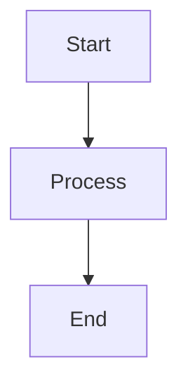

# 📁 File Viewer Components - Complete Implementation

## ✅ Created Components

All file viewer components have been successfully created in `frontend/src/components/`:

### 1. **MarkdownRenderer.vue** ✨
Renders Markdown with full GitHub Flavored Markdown support.

**Features:**
- ✅ Markdown rendering via marked.js
- ✅ Mermaid diagram support (```mermaid blocks)
- ✅ Code syntax highlighting via highlight.js
- ✅ Styled tables, lists, blockquotes, headings
- ✅ Dark theme optimized
- ✅ Auto-initialization of Mermaid on mount
- ✅ Reactive content updates

**Props:**
- `content` (String, required) - Markdown content to render

**Styling:**
- Custom styles for all markdown elements
- GitHub-dark theme for code blocks
- Responsive tables
- Mermaid diagram containers with error handling

---

### 2. **CodeViewer.vue** 💻
Displays code with syntax highlighting and line numbers.

**Features:**
- ✅ Syntax highlighting via highlight.js (github-dark theme)
- ✅ Line numbers with proper alignment
- ✅ Copy to clipboard button with feedback
- ✅ Auto-detect language if not specified
- ✅ 40+ language support
- ✅ Horizontal scrolling for long lines
- ✅ Language indicator in toolbar

**Props:**
- `content` (String, required) - Code content to display
- `language` (String, optional) - Language for syntax highlighting

**Supported Languages:**
python, javascript, typescript, java, cpp, c, csharp, php, ruby, go, rust, swift, kotlin, scala, bash, yaml, xml, sql, html, css, json, vue, and many more.

---

### 3. **PDFViewer.vue** 📄
Renders PDF files with page navigation.

**Features:**
- ✅ PDF rendering via pdfjs-dist
- ✅ Page navigation (Previous/Next buttons)
- ✅ Page counter display (current/total)
- ✅ 1.5x scale for better readability
- ✅ Canvas-based rendering
- ✅ Loading state with spinner
- ✅ Error handling with user-friendly messages
- ✅ Automatic CDN worker loading

**Props:**
- `pdfData` (String, required) - Base64 encoded PDF data

**Technical:**
- Uses PDF.js worker from CDN
- Renders one page at a time for performance
- Responsive canvas sizing

---

### 4. **FileViewer.vue** 🎯 (Main Component)
The orchestrator component that handles all file types automatically.

**Features:**
- ✅ Automatic file type detection by extension
- ✅ Loads content from API endpoints
- ✅ Renders appropriate viewer based on file type
- ✅ Toolbar with actions:
  - Open in Editor button
  - Copy content button (with feedback)
  - Download file button
- ✅ Loading state with spinner
- ✅ Error handling with retry button
- ✅ File name and type display
- ✅ Responsive design

**Props:**
- `filePath` (String, required) - Path to the file to display

**File Type Detection:**
- **Markdown**: `.md`, `.markdown`
- **Code**: `.py`, `.js`, `.ts`, `.jsx`, `.tsx`, `.json`, `.html`, `.css`, `.vue`, `.java`, `.cpp`, `.c`, `.go`, `.rs`, `.swift`, `.kt`, `.scala`, `.sh`, `.yaml`, `.yml`, `.xml`, `.sql`, `.php`, `.rb`, `.dart`
- **PDF**: `.pdf`
- **Text**: All other files (fallback)

**API Endpoints Used:**
- `GET /api/file/view?file={path}` - For text/code/markdown files
- `GET /api/file/pdf?file={path}` - For PDF files (returns base64)
- `POST /api/editor/open` - To open file in external editor

---

## 📦 Dependencies

All required dependencies are already in `package.json`:

```json
{
  "marked": "^11.0.0",        // Markdown parsing
  "mermaid": "^10.6.0",       // Diagram rendering
  "highlight.js": "^11.9.0",  // Syntax highlighting
  "pdfjs-dist": "^3.11.0"     // PDF rendering
}
```

**Installation:**
```bash
cd frontend
npm install
```

---

## 🚀 Usage

### Quick Start (Recommended)

Use `FileViewer` - it handles everything automatically:

```vue
<template>
  <FileViewer :filePath="'/docs/README.md'" />
</template>

<script setup>
import FileViewer from '@/components/FileViewer.vue'
</script>
```

### Integration with FileBrowser

Replace the simple preview modal in `FileBrowser.vue`:

```vue
<template>
  <div class="file-browser">
    <!-- ... existing file list ... -->

    <!-- Enhanced File Preview Modal -->
    <div v-if="filesStore.currentFile" class="modal-overlay">
      <div class="modal-container">
        <div class="modal-header">
          <h3>File Preview</h3>
          <button @click="closePreview">×</button>
        </div>
        <div class="modal-content">
          <FileViewer :filePath="filesStore.currentFile" />
        </div>
      </div>
    </div>
  </div>
</template>

<script setup>
import FileViewer from '@/components/FileViewer.vue'
import { useFilesStore } from '@/stores/files'

const filesStore = useFilesStore()

function closePreview() {
  filesStore.clearCurrentFile()
}
</script>
```

See `INTEGRATION_EXAMPLE.vue` for complete implementation.

---

## 📚 Documentation Files

Created comprehensive documentation:

1. **README.md** - Complete component documentation
   - Detailed feature descriptions
   - Props and usage examples
   - API endpoint specifications
   - Customization guide
   - Troubleshooting section

2. **QUICKSTART_FILEVIEWER.md** - Quick start guide
   - 5-minute setup
   - Basic usage examples
   - Common patterns
   - Tips and tricks

3. **INTEGRATION_EXAMPLE.vue** - Full integration example
   - Complete FileBrowser.vue with FileViewer
   - Modal implementation
   - Styling examples
   - Usage notes

---

## 🎨 Features Highlights

### Markdown Rendering
```markdown
# Heading
**Bold** and *italic* text



| Column 1 | Column 2 |
|----------|----------|
| Data 1   | Data 2   |
```

### Code Highlighting
- Automatic language detection
- 40+ languages supported
- Line numbers
- Copy button
- Dark theme

### PDF Viewing
- Page-by-page rendering
- Navigation controls
- Page counter
- High-quality rendering (1.5x scale)

### File Operations
- Open in editor (VS Code/Cursor)
- Copy content to clipboard
- Download file
- Loading states
- Error handling

---

## 🔧 Backend API Requirements

Your backend needs to implement these endpoints:

### 1. View Text File
```python
@app.get("/api/file/view")
async def view_file(file: str):
    """
    Returns file content as text.
    
    Query params:
        file: Path to the file
    
    Returns:
        {"content": "file content..."}
    """
    content = read_file(file)
    return {"content": content}
```

### 2. View PDF File
```python
@app.get("/api/file/pdf")
async def view_pdf(file: str):
    """
    Returns PDF file as base64 encoded string.
    
    Query params:
        file: Path to the PDF file
    
    Returns:
        {"content": "base64_encoded_pdf..."}
    """
    pdf_bytes = read_file_bytes(file)
    base64_pdf = base64.b64encode(pdf_bytes).decode()
    return {"content": base64_pdf}
```

### 3. Open in Editor (Optional)
```python
@app.post("/api/editor/open")
async def open_in_editor(request: dict):
    """
    Opens file in external editor.
    
    Body:
        {"path": "/path/to/file"}
    
    Returns:
        {"success": true}
    """
    path = request["path"]
    subprocess.run(["code", path])  # or "cursor"
    return {"success": True}
```

---

## 🎯 File Type Support

| Extension | Type | Viewer | Features |
|-----------|------|--------|----------|
| .md, .markdown | Markdown | MarkdownRenderer | GFM, Mermaid, Code highlighting |
| .py, .js, .ts | Code | CodeViewer | Syntax highlighting, line numbers |
| .json, .yaml | Code | CodeViewer | Syntax highlighting, line numbers |
| .html, .css | Code | CodeViewer | Syntax highlighting, line numbers |
| .pdf | PDF | PDFViewer | Page navigation, zoom |
| .txt, .log | Text | Plain text | Simple text display |
| Others | Text | Plain text | Fallback viewer |

---

## 🎨 Styling

All components use:
- **TailwindCSS** for utility classes
- **Dark theme** optimized (gray-800/900 backgrounds)
- **Smooth transitions** and hover effects
- **Responsive design** for all screen sizes
- **Custom scrollbars** for better aesthetics
- **Loading spinners** for async operations
- **Error states** with retry buttons

---

## 🐛 Troubleshooting

### Mermaid Diagrams Not Rendering
- Check browser console for syntax errors
- Verify mermaid code block format: ```mermaid
- Test with simple diagram first
- Ensure mermaid is initialized

### PDF Not Loading
- Verify PDF data is valid base64
- Check PDF.js worker is accessible
- Look for CORS issues in console
- Test with small PDF first

### Code Not Highlighting
- Verify language is supported by highlight.js
- Try auto-detection (omit language prop)
- Check file extension mapping
- Ensure highlight.js CSS is loaded

### API Errors
- Check network tab in DevTools
- Verify endpoint URLs are correct
- Check CORS configuration
- Verify file paths are correct

---

## 🚀 Next Steps

1. **Install dependencies:**
   ```bash
   cd frontend
   npm install
   ```

2. **Implement backend API endpoints:**
   - `/api/file/view` for text files
   - `/api/file/pdf` for PDF files
   - `/api/editor/open` for editor integration

3. **Integrate with FileBrowser:**
   - Import FileViewer component
   - Replace simple preview modal
   - Test with different file types

4. **Test thoroughly:**
   - Markdown files with Mermaid diagrams
   - Code files in various languages
   - PDF files
   - Large files
   - Error cases

5. **Customize as needed:**
   - Change highlight.js theme
   - Adjust Mermaid theme
   - Modify toolbar buttons
   - Add new file type support

---

## 📊 Component Architecture

```
FileViewer.vue (Main Orchestrator)
├── Detects file type by extension
├── Loads content from API
├── Shows toolbar with actions
└── Renders appropriate viewer:
    ├── MarkdownRenderer.vue
    │   ├── marked.js (Markdown parsing)
    │   ├── mermaid.js (Diagrams)
    │   └── highlight.js (Code blocks)
    ├── CodeViewer.vue
    │   ├── highlight.js (Syntax highlighting)
    │   └── Line numbers + Copy button
    ├── PDFViewer.vue
    │   ├── pdfjs-dist (PDF rendering)
    │   └── Page navigation
    └── Plain text viewer (Fallback)
```

---

## ✨ Key Features Summary

✅ **Automatic file type detection**
✅ **Rich Markdown rendering with Mermaid**
✅ **Syntax highlighting for 40+ languages**
✅ **PDF viewing with navigation**
✅ **Copy to clipboard**
✅ **Download files**
✅ **Open in editor**
✅ **Loading states**
✅ **Error handling**
✅ **Dark theme optimized**
✅ **Responsive design**
✅ **Line numbers for code**
✅ **Mermaid diagram support**
✅ **GitHub-dark theme**

---

## 📝 Files Created

```
frontend/src/components/
├── MarkdownRenderer.vue          # Markdown + Mermaid viewer
├── CodeViewer.vue                # Code with syntax highlighting
├── PDFViewer.vue                 # PDF viewer with navigation
├── FileViewer.vue                # Main orchestrator component
├── README.md                     # Complete documentation
├── QUICKSTART_FILEVIEWER.md      # Quick start guide
└── INTEGRATION_EXAMPLE.vue       # Full integration example
```

---

## 🎉 Ready to Use!

All components are production-ready and fully documented. Start with `FileViewer` for the easiest integration, or use individual viewers for more control.

**Happy coding!** 🚀

