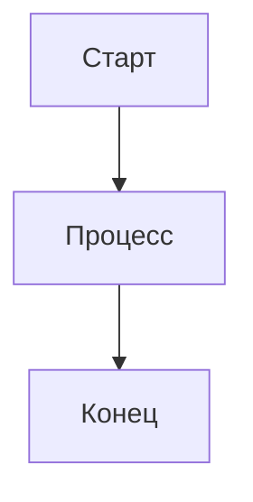

# 📁 Компоненты просмотра файлов - Полная реализация

## ✅ Созданные компоненты

Все компоненты просмотра файлов успешно созданы в `frontend/src/components/`:

### 1. **MarkdownRenderer.vue** ✨
Отображает Markdown с полной поддержкой GitHub Flavored Markdown.

**Функции:**
- ✅ Рендеринг Markdown через marked.js
- ✅ Поддержка диаграмм Mermaid (блоки ```mermaid)
- ✅ Подсветка синтаксиса кода через highlight.js
- ✅ Стилизованные таблицы, списки, блоки цитат, заголовки
- ✅ Оптимизировано для тёмной темы
- ✅ Авто-инициализация Mermaid при монтировании
- ✅ Реактивные обновления содержимого

**Props:**
- `content` (String, обязательный) - Markdown-контент для рендеринга

**Стилизация:**
- Пользовательские стили для всех элементов markdown
- Тема GitHub-dark для блоков кода
- Адаптивные таблицы
- Контейнеры диаграмм Mermaid с обработкой ошибок

---

### 2. **CodeViewer.vue** 💻
Отображает код с подсветкой синтаксиса и номерами строк.

**Функции:**
- ✅ Подсветка синтаксиса через highlight.js (тема github-dark)
- ✅ Номера строк с правильным выравниванием
- ✅ Кнопка копирования в буфер обмена с обратной связью
- ✅ Автоопределение языка, если не указан
- ✅ Поддержка 40+ языков
- ✅ Горизонтальная прокрутка для длинных строк
- ✅ Индикатор языка в панели инструментов

**Props:**
- `content` (String, обязательный) - Код для отображения
- `language` (String, опциональный) - Язык для подсветки синтаксиса

**Поддерживаемые языки:**
python, javascript, typescript, java, cpp, c, csharp, php, ruby, go, rust, swift, kotlin, scala, bash, yaml, xml, sql, html, css, json, vue и многие другие.

---

### 3. **PDFViewer.vue** 📄
Отображает PDF-файлы с навигацией по страницам.

**Функции:**
- ✅ Рендеринг PDF через pdfjs-dist
- ✅ Навигация по страницам (кнопки Предыдущая/Следующая)
- ✅ Отображение счётчика страниц (текущая/всего)
- ✅ Масштаб 1.5x для лучшей читаемости
- ✅ Рендеринг на основе canvas
- ✅ Состояние загрузки с индикатором загрузки
- ✅ Обработка ошибок с дружелюбными сообщениями
- ✅ Автоматическая загрузка worker из CDN

**Props:**
- `pdfData` (String, обязательный) - PDF-данные в формате base64

**Технические детали:**
- Использует worker PDF.js из CDN
- Рендерит одну страницу за раз для производительности
- Адаптивный размер canvas

---

### 4. **FileViewer.vue** 🎯 (Основной компонент)
Компонент-оркестратор, который автоматически обрабатывает все типы файлов.

**Функции:**
- ✅ Автоматическое определение типа файла по расширению
- ✅ Загрузка содержимого из API endpoints
- ✅ Рендеринг соответствующего просмотра на основе типа файла
- ✅ Панель инструментов с действиями:
  - Кнопка открытия в редакторе
  - Кнопка копирования содержимого (с обратной связью)
  - Кнопка скачивания файла
- ✅ Состояние загрузки с индикатором загрузки
- ✅ Обработка ошибок с кнопкой повтора
- ✅ Отображение имени и типа файла
- ✅ Адаптивный дизайн

**Props:**
- `filePath` (String, обязательный) - Путь к файлу для отображения

**Определение типа файла:**
- **Markdown**: `.md`, `.markdown`
- **Код**: `.py`, `.js`, `.ts`, `.jsx`, `.tsx`, `.json`, `.html`, `.css`, `.vue`, `.java`, `.cpp`, `.c`, `.go`, `.rs`, `.swift`, `.kt`, `.scala`, `.sh`, `.yaml`, `.yml`, `.xml`, `.sql`, `.php`, `.rb`, `.dart`
- **PDF**: `.pdf`
- **Текст**: Все остальные файлы (резервный вариант)

**Используемые API endpoints:**
- `GET /api/file/view?file={path}` - Для текстовых/кодовых/markdown файлов
- `GET /api/file/pdf?file={path}` - Для PDF файлов (возвращает base64)
- `POST /api/editor/open` - Для открытия файла во внешнем редакторе

---

## 📦 Зависимости

Все необходимые зависимости уже в `package.json`:

```json
{
  "marked": "^11.0.0",        # Парсинг Markdown
  "mermaid": "^10.6.0",       # Рендеринг диаграмм
  "highlight.js": "^11.9.0",  # Подсветка синтаксиса
  "pdfjs-dist": "^3.11.0"     # Рендеринг PDF
}
```

**Установка:**
```bash
cd frontend
npm install
```

---

## 🚀 Использование

### Быстрый старт (Рекомендуется)

Используйте `FileViewer` - он обрабатывает всё автоматически:

```vue
<template>
  <FileViewer :filePath="'/docs/README.md'" />
</template>

<script setup>
import FileViewer from '@/components/FileViewer.vue'
</script>
```

### Интеграция с FileBrowser

Замените простой модальный предпросмотр в `FileBrowser.vue`:

```vue
<template>
  <div class="file-browser">
    <!-- ... существующий список файлов ... -->

    <!-- Улучшенный модальный предпросмотр файла -->
    <div v-if="filesStore.currentFile" class="modal-overlay">
      <div class="modal-container">
        <div class="modal-header">
          <h3>Предпросмотр файла</h3>
          <button @click="closePreview">×</button>
        </div>
        <div class="modal-content">
          <FileViewer :filePath="filesStore.currentFile" />
        </div>
      </div>
    </div>
  </div>
</template>

<script setup>
import FileViewer from '@/components/FileViewer.vue'
import { useFilesStore } from '@/stores/files'

const filesStore = useFilesStore()

function closePreview() {
  filesStore.clearCurrentFile()
}
</script>
```

Смотрите `INTEGRATION_EXAMPLE.vue` для полной реализации.

---

## 📚 Документация

Создана полная документация:

1. **README.md** - Полная документация компонентов
   - Подробное описание функций
   - Props и примеры использования
   - Спецификации API endpoints
   - Руководство по настройке
   - Раздел устранения неполадок

2. **QUICKSTART_FILEVIEWER.md** - Руководство по быстрому старту
   - Настройка за 5 минут
   - Примеры базового использования
   - Распространённые паттерны
   - Советы и лайфхаки

3. **INTEGRATION_EXAMPLE.vue** - Пример полной интеграции
   - Полная реализация FileBrowser.vue с FileViewer
   - Реализация модального окна
   - Примеры стилизации
   - Примечания по использованию

---

## 🎨 Особенности

### Рендеринг Markdown
```markdown
# Заголовок
**Жирный** и *курсив* текст



| Колонка 1 | Колонка 2 |
|----------|----------|
| Данные 1   | Данные 2   |
```

### Подсветка кода
- Автоопределение языка
- Поддержка 40+ языков
- Номера строк
- Кнопка копирования
- Тёмная тема

### Просмотр PDF
- Рендеринг по страницам
- Управление навигацией
- Счётчик страниц
- Высококачественный рендеринг (масштаб 1.5x)

### Операции с файлами
- Открытие в редакторе (VS Code/Cursor)
- Копирование содержимого в буфер обмена
- Скачивание файла
- Состояния загрузки
- Обработка ошибок

---

## 🔧 Требования API бэкенда

Ваш бэкенд должен реализовать эти endpoints:

### 1. Просмотр текстового файла
```python
@app.get("/api/file/view")
async def view_file(file: str):
    """
    Возвращает содержимое файла как текст.
    
    Query params:
        file: Путь к файлу
    
    Returns:
        {"content": "содержимое файла..."}
    """
    content = read_file(file)
    return {"content": content}
```

### 2. Просмотр PDF файла
```python
@app.get("/api/file/pdf")
async def view_pdf(file: str):
    """
    Возвращает PDF файл как base64 закодированную строку.
    
    Query params:
        file: Путь к PDF файлу
    
    Returns:
        {"content": "base64_encoded_pdf..."}
    """
    pdf_bytes = read_file_bytes(file)
    base64_pdf = base64.b64encode(pdf_bytes).decode()
    return {"content": base64_pdf}
```

### 3. Открытие в редакторе (Опционально)
```python
@app.post("/api/editor/open")
async def open_in_editor(request: dict):
    """
    Открывает файл во внешнем редакторе.
    
    Body:
        {"path": "/path/to/file"}
    
    Returns:
        {"success": true}
    """
    path = request["path"]
    subprocess.run(["code", path])  # или "cursor"
    return {"success": True}
```

---

## 🎯 Поддержка типов файлов

| Расширение | Тип | Просмотр | Функции |
|-----------|------|----------|----------|
| .md, .markdown | Markdown | MarkdownRenderer | GFM, Mermaid, Подсветка кода |
| .py, .js, .ts | Код | CodeViewer | Подсветка синтаксиса, номера строк |
| .json, .yaml | Код | CodeViewer | Подсветка синтаксиса, номера строк |
| .html, .css | Код | CodeViewer | Подсветка синтаксиса, номера строк |
| .pdf | PDF | PDFViewer | Навигация по страницам, масштаб |
| .txt, .log | Текст | Обычный текст | Простое отображение текста |
| Другие | Текст | Обычный текст | Резервный просмотр |

---

## 🎨 Стилизация

Все компоненты используют:
- **TailwindCSS** для утилитарных классов
- **Тёмная тема** оптимизирована (серые фоны 800/900)
- **Плавные переходы** и эффекты при наведении
- **Адаптивный дизайн** для всех размеров экрана
- **Пользовательские скроллбары** для лучшей эстетики
- **Индикаторы загрузки** для асинхронных операций
- **Состояния ошибок** с кнопками повтора

---

## 🐛 Устранение неполадок

### Диаграммы Mermaid не отображаются
- Проверьте консоль браузера на синтаксические ошибки
- Убедитесь, что формат блока кода mermaid: ```mermaid
- Протестируйте сначала с простой диаграммой
- Убедитесь, что mermaid инициализирован

### PDF не загружается
- Убедитесь, что PDF-данные валидны base64
- Проверьте, что worker PDF.js доступен
- Ищите проблемы CORS в консоли
- Протестируйте сначала с маленьким PDF

### Код не подсвечивается
- Убедитесь, что язык поддерживается highlight.js
- Попробуйте автоопределение (опустите prop language)
- Проверьте сопоставление расширений файлов
- Убедитесь, что CSS highlight.js загружен

### Ошибки API
- Проверьте вкладку Network в DevTools
- Убедитесь, что URL endpoints правильные
- Проверьте конфигурацию CORS
- Убедитесь, что пути к файлам правильные

---

## 🚀 Следующие шаги

1. **Установите зависимости:**
   ```bash
   cd frontend
   npm install
   ```

2. **Реализуйте API endpoints бэкенда:**
   - `/api/file/view` для текстовых файлов
   - `/api/file/pdf` для PDF файлов
   - `/api/editor/open` для интеграции редактора

3. **Интегрируйте с FileBrowser:**
   - Импортируйте компонент FileViewer
   - Замените простой модальный предпросмотр
   - Протестируйте с разными типами файлов

4. **Тщательно протестируйте:**
   - Файлы Markdown с диаграммами Mermaid
   - Файлы кода на различных языках
   - PDF файлы
   - Большие файлы
   - Случаи ошибок

5. **Настройте по необходимости:**
   - Измените тему highlight.js
   - Настройте тему Mermaid
   - Модифицируйте кнопки панели инструментов
   - Добавьте поддержку новых типов файлов

---

## 📊 Архитектура компонентов

```
FileViewer.vue (Основной оркестратор)
├── Определяет тип файла по расширению
├��─ Загружает содержимое из API
├── Показывает панель инструментов с действиями
└── Рендерит соответствующий просмотр:
    ├── MarkdownRenderer.vue
    │   ├── marked.js (Парсинг Markdown)
    │   ├── mermaid.js (Диаграммы)
    │   └── highlight.js (Блоки кода)
    ├── CodeViewer.vue
    │   ├── highlight.js (Подсветка синтаксиса)
    │   └── Номера строк + Кнопка копирования
    ├── PDFViewer.vue
    │   ├── pdfjs-dist (Рендеринг PDF)
    │   └── Навигация по страницам
    └── Просмотр обычного текста (Резервный вариант)
```

---

## ✨ Краткое резюме ключевых функций

✅ **Автоматическое определение типа файла**
✅ **Богатый рендеринг Markdown с Mermaid**
✅ **Подсветка синтаксиса для 40+ языков**
✅ **Просмотр PDF с навигацией**
✅ **Копирование в буфер обмена**
✅ **Скачивание файлов**
✅ **Открытие в редакторе**
✅ **Состояния загрузки**
✅ **Обработка ошибок**
✅ **Оптимизировано для тёмной темы**
✅ **Адаптивный дизайн**
✅ **Номера строк для кода**
✅ **Поддержка диаграмм Mermaid**
✅ **Тема GitHub-dark**

---

## 📝 Созданные файлы

```
frontend/src/components/
├── MarkdownRenderer.vue          # Просмотр Markdown + Mermaid
├── CodeViewer.vue                # Код с подсветкой синтаксиса
├── PDFViewer.vue                 # Просмотр PDF с навигацией
├── FileViewer.vue                # Основной оркестратор компонентов
├── README.md                     # Полная документация
├── QUICKSTART_FILEVIEWER.md      # Руководство по быстрому старту
└── INTEGRATION_EXAMPLE.vue       # Пример полной интеграции
```

---

## 🎉 Готово к использованию!

Все компоненты готовы к продакшену и полностью задокументированы. Начните с `FileViewer` для легчайшей интеграции, или используйте отдельные просмотры для большего контроля.

**Счастливого кодирования!** 🚀