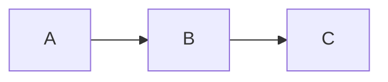

# File Viewer Components

Comprehensive file viewing components for LocalGitMirror with support for Markdown, code, PDF, and text files.

## Components Overview

### 1. FileViewer.vue (Main Component)
The main component that orchestrates file viewing based on file type.

**Features:**
- Automatic file type detection by extension
- Toolbar with actions (Open in Editor, Copy, Download)
- Loading and error states
- API integration for file content loading

**Usage:**
```vue
<template>
  <FileViewer :filePath="'/path/to/file.md'" />
</template>

<script setup>
import FileViewer from '@/components/FileViewer.vue'
</script>
```

**Props:**
- `filePath` (String, required) - Path to the file to display

**Supported File Types:**
- **Markdown**: `.md`, `.markdown`
- **Code**: `.py`, `.js`, `.ts`, `.jsx`, `.tsx`, `.json`, `.html`, `.css`, `.vue`, etc.
- **PDF**: `.pdf`
- **Text**: All other text files

### 2. MarkdownRenderer.vue
Renders Markdown content with full GitHub Flavored Markdown support.

**Features:**
- Markdown rendering via marked.js
- Mermaid diagram support (```mermaid blocks)
- Code syntax highlighting via highlight.js
- Styled tables, lists, blockquotes
- Dark theme optimized

**Usage:**
```vue
<template>
  <MarkdownRenderer :content="markdownContent" />
</template>

<script setup>
import MarkdownRenderer from '@/components/MarkdownRenderer.vue'
import { ref } from 'vue'

const markdownContent = ref(`
# Hello World

This is **bold** and this is *italic*.

\`\`\`mermaid
graph TD
    A[Start] --> B[Process]
    B --> C[End]
\`\`\`
`)
</script>
```

**Props:**
- `content` (String, required) - Markdown content to render

**Mermaid Support:**
Automatically detects and renders Mermaid diagrams in code blocks:
```markdown

```

### 3. CodeViewer.vue
Displays code with syntax highlighting and line numbers.

**Features:**
- Syntax highlighting via highlight.js (github-dark theme)
- Line numbers
- Copy to clipboard button
- Auto-detect language or specify manually
- 40+ language support

**Usage:**
```vue
<template>
  <CodeViewer :content="code" language="python" />
</template>

<script setup>
import CodeViewer from '@/components/CodeViewer.vue'
import { ref } from 'vue'

const code = ref(`
def hello_world():
    print("Hello, World!")
`)
</script>
```

**Props:**
- `content` (String, required) - Code content to display
- `language` (String, optional) - Language for syntax highlighting (auto-detected if not provided)

**Supported Languages:**
python, javascript, typescript, java, cpp, c, csharp, php, ruby, go, rust, swift, kotlin, scala, bash, yaml, xml, sql, html, css, json, and many more.

### 4. PDFViewer.vue
Renders PDF files with page navigation.

**Features:**
- PDF rendering via pdfjs-dist
- Page navigation (Previous/Next buttons)
- Page counter display
- 1.5x scale for better readability
- Loading and error states

**Usage:**
```vue
<template>
  <PDFViewer :pdfData="base64PdfData" />
</template>

<script setup>
import PDFViewer from '@/components/PDFViewer.vue'
import { ref } from 'vue'

const base64PdfData = ref('JVBERi0xLjQKJeLjz9MKMSAwIG9iago8PC...')
</script>
```

**Props:**
- `pdfData` (String, required) - Base64 encoded PDF data

## API Endpoints

The FileViewer component expects these backend endpoints:

### Text Files
```
GET /api/file/view?file={path}
Response: { "content": "file content..." }
```

### PDF Files
```
GET /api/file/pdf?file={path}
Response: { "content": "base64_encoded_pdf..." }
```

### Open in Editor
```
POST /api/editor/open
Body: { "path": "/path/to/file" }
```

## Installation

These components require the following dependencies (already in package.json):

```json
{
  "dependencies": {
    "marked": "^11.0.0",
    "mermaid": "^10.6.0",
    "highlight.js": "^11.9.0",
    "pdfjs-dist": "^3.11.0"
  }
}
```

## Integration Example

### In FileBrowser.vue

Replace the simple preview modal with FileViewer:

```vue
<template>
  <div class="file-browser">
    <!-- ... existing code ... -->

    <!-- File Preview Modal -->
    <div v-if="filesStore.currentFile" class="modal-overlay">
      <div class="modal-container">
        <div class="modal-header">
          <h3 class="text-lg font-bold">{{ filesStore.currentFile }}</h3>
          <button @click="closePreview" class="close-button">
            <svg class="w-6 h-6" fill="none" stroke="currentColor" viewBox="0 0 24 24">
              <path stroke-linecap="round" stroke-linejoin="round" stroke-width="2" d="M6 18L18 6M6 6l12 12" />
            </svg>
          </button>
        </div>
        <div class="modal-content">
          <FileViewer :filePath="filesStore.currentFile" />
        </div>
      </div>
    </div>
  </div>
</template>

<script setup>
import { ref, onMounted } from 'vue'
import { useFilesStore } from '@/stores/files'
import FileViewer from '@/components/FileViewer.vue'

const filesStore = useFilesStore()

function closePreview() {
  filesStore.clearCurrentFile()
}

// ... rest of the code
</script>

<style scoped>
.modal-overlay {
  @apply fixed inset-0 bg-black bg-opacity-50 flex items-center justify-center z-50 p-4;
}

.modal-container {
  @apply bg-gray-800 rounded-lg max-w-6xl w-full max-h-[90vh] overflow-hidden flex flex-col;
}

.modal-header {
  @apply flex items-center justify-between p-4 border-b border-gray-700;
}

.modal-content {
  @apply flex-1 overflow-hidden;
}

.close-button {
  @apply text-gray-400 hover:text-white transition-colors;
}
</style>
```

### Standalone Usage

```vue
<template>
  <div class="page">
    <h1>View File</h1>
    <FileViewer :filePath="currentFilePath" />
  </div>
</template>

<script setup>
import { ref } from 'vue'
import FileViewer from '@/components/FileViewer.vue'

const currentFilePath = ref('/docs/README.md')
</script>
```

## Styling

All components use TailwindCSS and are designed for dark theme. They include:
- Consistent color scheme (gray-800/900 backgrounds)
- Smooth transitions and hover effects
- Responsive design
- Custom scrollbar styling
- Loading spinners and error states

## Customization

### Change Highlight.js Theme

In CodeViewer.vue or MarkdownRenderer.vue:
```javascript
import 'highlight.js/styles/github-dark.css'  // Change to any theme
```

Available themes: github-dark, monokai, atom-one-dark, vs2015, etc.

### Change Mermaid Theme

In MarkdownRenderer.vue:
```javascript
mermaid.initialize({
  theme: 'dark',  // Options: 'default', 'dark', 'forest', 'neutral'
  // ... other options
})
```

### Adjust PDF Scale

In PDFViewer.vue:
```javascript
const scale = 1.5  // Change to 1.0, 2.0, etc.
```

## Troubleshooting

### Mermaid Diagrams Not Rendering
- Check browser console for errors
- Ensure mermaid syntax is correct
- Try wrapping in ```mermaid code blocks

### PDF Not Loading
- Verify PDF data is valid base64
- Check PDF.js worker path is accessible
- Look for CORS issues in browser console

### Code Not Highlighting
- Verify language is supported by highlight.js
- Check if language name is correct
- Try auto-detection by not specifying language

### File Not Loading
- Check API endpoint is correct
- Verify file path is valid
- Check network tab for API errors

## Performance Tips

1. **Large Files**: Consider implementing pagination or lazy loading for very large files
2. **PDF Files**: PDFs are rendered page-by-page, so performance is good even for large documents
3. **Mermaid**: Complex diagrams may take time to render; consider showing a loading indicator
4. **Code Files**: Highlight.js handles large files well, but consider limiting display for files > 10,000 lines

## Browser Support

- Chrome/Edge: Full support
- Firefox: Full support
- Safari: Full support (PDF.js may need polyfills)

## License

Part of LocalGitMirror project.

## Contributing

When adding new file type support:
1. Add extension to `fileType` computed property in FileViewer.vue
2. Create new viewer component if needed
3. Update this README with new file type
4. Test with sample files

